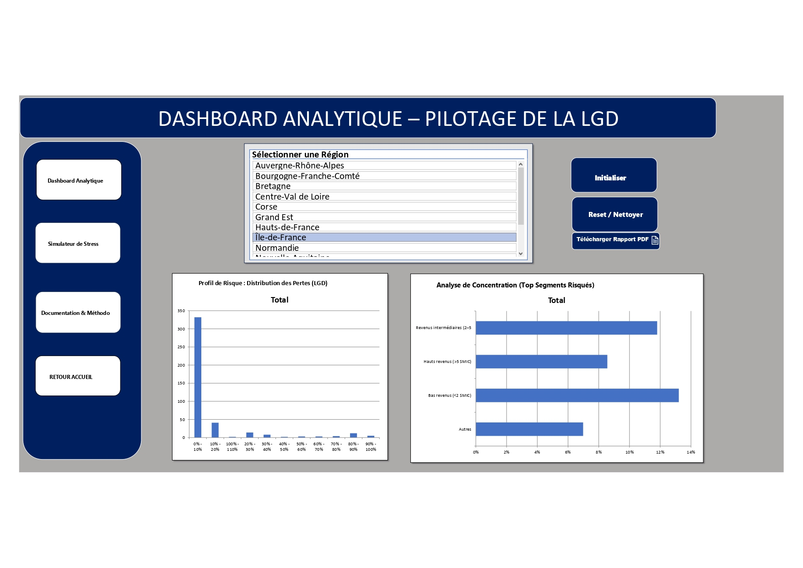
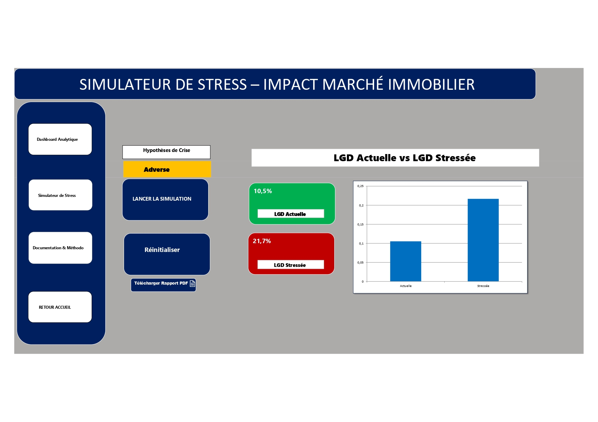
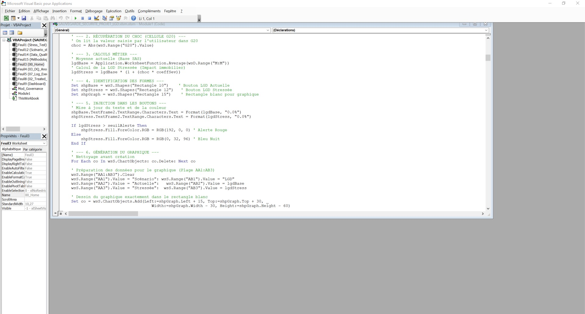

# 🏦 Plateforme VBA : Évaluation LGD & Stress Testing

## 📝 Description du Projet
Cet outil avancé, développé sous **VBA (Excel)**, est une solution d'analyse et d'audit dédiée à la **LGD (Loss Given Default)** pour des portefeuilles bancaires (Prêts Immobiliers). 

L'outil permet de centraliser l'audit de la qualité des données, l'analyse de la sévérité des pertes et la simulation d'impacts en cas de choc économique (**Stress Testing**), répondant ainsi aux enjeux réglementaires (Bâle III, IFRS 9).

## 🚀 Fonctionnalités Clés
* **Audit & Santé des Données :** Diagnostic automatique du taux de complétude des variables critiques (Id_client, Taux d'apport, LGD observée, etc.). Dans ce projet, le score de santé atteint **87%**.
* **Analytics Dashboard :** Visualisation dynamique des indicateurs de sévérité et du volume du portefeuille (11 779 lignes analysées).
* **Moteur de Stress Testing :** Simulateur intégré permettant d'appliquer des scénarios de crise pour évaluer la résilience du portefeuille et l'évolution de l'Expected Loss.
* **Reporting Automatisé :** Génération de documentations méthodologiques et export de rapports de synthèse au format PDF.

## 🛠️ Stack Technique
* **Langage :** VBA (Visual Basic for Applications).
* **Expertise Métier :** Risque de Crédit, Paramètres Bâlois, Modélisation de Sévérité, IFRS 9.
* **Analyse de Données :** Statistiques descriptives (Moyenne, Écart-type, Kurtosis, Skewness) appliquées aux variables financières.

## 📊 Aperçu de la Plateforme

Pour illustrer le fonctionnement de l'outil, voici les trois piliers de l'application :

### 1. Dashboard Analytique (Pilotage)
Interface principale permettant de suivre la santé des données (87% de complétude) et les indicateurs clés du portefeuille de 11 779 lignes.

### 2. Simulateur de Stress Test (Gestion des Risques)
Module dédié à l'application de scénarios macroéconomiques pour évaluer la résilience de la LGD face aux chocs de marché.

### 3. Moteur VBA (Architecture Technique)
Aperçu de la logique de programmation backend permettant l'automatisation des contrôles qualité et la génération des rapports PDF.

## 📁 Structure du Dépôt
* `/Outil` : `Plateforme_LGD_Stress_Testing.xlsm` (L'application principale).
* `/Docs` : Documentation détaillée sur la méthodologie et les objectifs opérationnels.
* `/Screenshots` : Visuels de l'interface utilisateur (UserForms et Dashboard).

## 💡 Utilisation
1.  Téléchargez le fichier `.xlsm`.
2.  **Activez les macros** à l'ouverture pour initialiser l'interface VBA.
3.  Utilisez le menu principal pour naviguer entre :
    * Le lancement des **Contrôles Qualités**.
    * La génération du **Dashboard Analytique**.
    * L'application des **Scénarios de Crise**.

---
*Note : Ce projet démontre une double compétence en ingénierie financière et en automatisation d'outils d'aide à la décision.*
